디플로메시

[1.컨셉](#컨셉)  
[2.메인컨셉](#메인컨셉)  
[3.서브컨셉](#서브컨셉)  
[4.미적요소](#미적요소)  
[5.메커니즘](#메커니즘)  
[6.스토리](#스토리)  
[7.게임 시스템](#게임-시스템)  
	[	7_1. 게임 오브젝트 분해](#1-게임-오브젝트-분해)  
	[	7_2. 속성 뽑아 보기](#2-속성-뽑아-보기)  
	[	7_3. 행동 뽑아 보기](#3-행동-뽑아-보기)  
	[	7_4. 상태 뽑아 보기](#4-상태-뽑아-보기)  
	[	7_5. 플레이어 캐릭터 속성](#5-플레이어-캐릭터-속성)  
	[	7_6. 게임의 규칙](#6-게임의-규칙)  
	[	7_7. 게임에 사용될 공식](#7-게임에-사용될-공식)  
[8.개발 요구사항 & 흐름도](#개발-요구사항&흐름도)  
[9.스토리보드](#스토리보드)  
[10.개발작업 일정](#개발작업-일정)  
# 컨셉

## 메인컨셉
1. 스토리 창조
    * 플레이어들이 만들어가는 세계정세에 관한 이야기의 주인공이 된다.
    * 플레이어들로 하여금 미래의 정세를 만들어 가는 주인공으로써의 희열감을 느끼게 해준다.
    
## 서브컨셉
1. 역사
    * 실제 있었던 이야기를 어느정도 도입해 스토리에 몰입감을 줌으로써 유저들에게 어필한다.
    * 다양한 특색을 지닌 나라, 유닛들을 소개해 소소한 재미를 선사해 준다.
2. 판타지
    * 공상적인 요소(신화, 전설속 요소들)을 도입하여 세계관에 매력을 더해준다.
    * 전설에 나오는 유물들을 추가해 특수한 효과를 도입 한다.(유물은 전투, 경영에 보너스를 더 해준다)
3. 전투
    * 플레이 성향에 따라 공격적, 방어적 플레이를 지원한다.
4. 경영
    * 발전등의 요소들을 도입해 플레이어에게 성장의 재미를 부여해 준다.
5. 심리전
    * 유저들간 음모가 오가는 정치싸움 요소를 도입한다.

## 기술
* 장르: RTS
* 플랫폼: PC
* 개발환경: Unity

## 미적요소

## 메커니즘
[목표]  
플레이어의 나라 혹은 동맹이 전체국력의 과반을 넘긴 상태를 일정시간 동안 유지하면 승리  

[진행]  
1. 국가선택(자유롭게 선택하는 기능과 랜덤으로 선택하는 기능 존재)
2. 발전, 전쟁 및 외교 진행
3. 목표달성

[재미요소]  
* 자신이 구성한 군대의 배치 및 병력구성으로 상대방을 이기는 재미(전투파트)  
* 유저가 고른 나라가 유저의 선택에 의해 점점 강해지는 걸 보는 육성의 재미.(내정파트)  
* 견제와 통수가 난무하는 정치판에서의 긴장감과 상호작용에서 오는 재미(외교파트)  
* 게임에 구현된 국가 및 유닛에 얽힌 배경설정을 보는 재미.(스토리파트)  

[참고이미지]  

  

### 3_1 재미요소_전투파트
* 유닛: 유닛들은 서로 상성 관계를 가지고 있다. 그러므로 그에 따른 조합 구상이 필요하다 그리고 몇몇 국가들은 특화 유닛을 생산할 수 있다.
    * 지상유닛 
      *보병: 보병,돌격병,저격병,공병,의무병 
      *기갑: 장갑차,경전차,중전차,자주포 
    * 해상유닛 
      *수상함: 초계함,구축함,순양전함,항공모함,수송함,지원함 
      *잠수함: 잠수함 
    * 공중유닛 
      *비행기: 건쉽,전투기,폭격기,수송기,비행선 

* 건물: ‘생산건물’과 ‘방어건물’이 존재한다.
	* 생산건물: 병력을 생산하는데 필요한 건물들. 공격플레이를 하고 싶은 유저들에게 추천
	* 방어건물: 적을 막아내는데 필요한 건물들. 방어플레이를 하고 싶은 유저들에게 추천. (방어건물은 유닛에 대해 상성 관계를 갖고 있다. 그러므로 상대방의 조합에 따른 알맞은 방어시설이 요구된다.방어건물 또한 국가에 따라 특화건물을 지을 수 있다)

### 3_2 재미요소_내정파트
* 경제: ‘돈’과 ‘에너지’ 자원이 있다
    * 돈: 도시의 산업을 발전시켜서 ‘돈’을 벌어 들일 수 있다
    * 에너지: 지도 곳곳에 위치한 ‘자원매장지’에서 얻을 수 있다
* 기술: ‘민간기술’과 ‘군사기술’이 존재한다
    * 민간기술: 산업을 발전시키기 위한 기술 리스트 들이다
    * 군사기술: 군사력을 발전시키기 위한 기술 리스트 들이다

### 3_3 재미요소_외교파트
* 채팅기능: ‘1대1채팅’, ‘동맹채팅’, ‘전체채팅’을 지원함으로써 유저가 모략을 꾸밀 수 있는 다양한 경로를 지원한다
    * 1대1채팅: 두 명의 유저가 대화할 때 쓰는 기능
    * 동맹채팅: 동맹 구성원들 끼리 대화할 때 쓰는 기능
    * 전체채팅: 모든 유저가 참여할 수 있는 채팅
* 첩보기능: ‘첩보활동’ 기능을 지원함으로써 유저가 모략을 꾸밀 수 있는 방법을 지원한다
    * 첩보활동: 상대방의 채팅을 엿볼 수 있는 기능, 상대방이 어떤 테크트리를 타고 있는지 확인하는 기능, 상대방의 무기설계도를 가져오는 기능
* 방첩기능: ‘방첩활동’ 기능을 지원함으로써 다른 유저의 훼방을 막을 수 있는 방법을 지원한다
    * 방첩기능: 상대방이 내 메시지와 테크트리를 엿보는 것을 막는 기능,  상대방에게 거짓정보를 흘리는 기능, 상대방의 무기설계도를 역으로 가져오는 기능
* 협력기능: 플레이어는 다른 유저와 협력 관계를 맺을 수 있으며, ‘경제협력’, ‘군사협력’기능을 사용 할 수 있다. (이 중 하나만 하는 것도 가능)
    * 경제협력: 1 ~ 3단계의 경제협력 단계가 존재함. 각 단계마다 효과를 받을 수 있다.  
      1.PTA(특혜무역협정):  
      2.FTA(자유무역협정): 
      3.CM(공동시장): 
    * 군사협력: 1 ~ 3단계의 군사협력 단계가 존재함. 각 단계마다  효과를 받을 수 있다.  
      1.불가침조약: 서로 침략을 할 수 없다. 
      2.지소미아: 서로의 시야를 공유한다, 서로의 특수 군사 유닛을 공유한다. 
      3.방위협정: 협정회원국이 침략당하면 다른 회원국들도 자동 참전한다,연합군을 따로 생산 할 수 있다.
      
## 스토리
* 특징
    * 대체역사: 실제 역사에 일어났던 사건이 다르게 흘러간 세계관을 표현하고 있습니다.
    * 역사고증: 심도 있는 역사에 대한 고증을 반영해 플레이 하는 사람이 소소한 재미를 느낄 수 있도록 하였습니다
    * 현대 판타지: 세계 여러 설화 속에 존재하는 요소들을 게임에 담아 현실과 판타지의 조합을 추구하였습니다

# 게임 시스템 

## 1. 게임 오브젝트 분해

| 순번 | 오브젝트 이름 | 사진 |
|:---:|:---:|:---:|
| 1 | 도시 ||
| 2 | 자원매장지 | |
| 3 | 생산건물_병영 |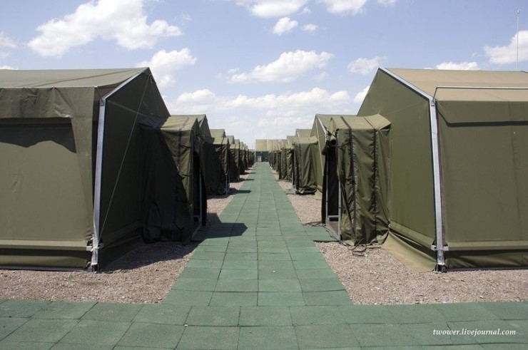 |
| 4 | 생산건물_공장 |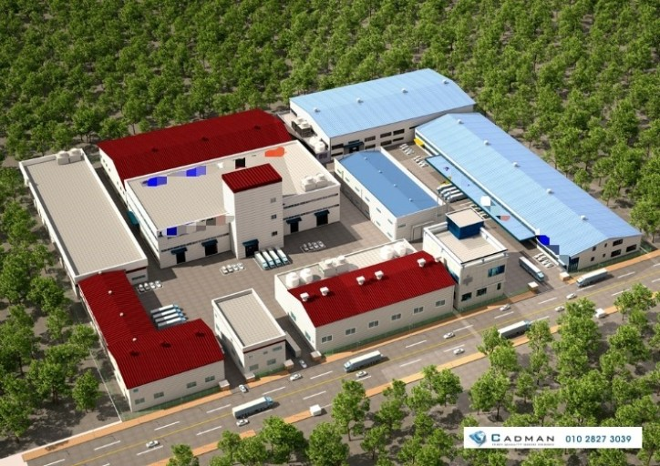 |
| 5 | 방어건물_요새 |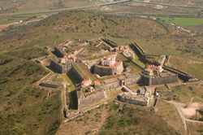 |
| 6 | 방어건물_격납고 | |
| 7 | 지상&해상유닛 |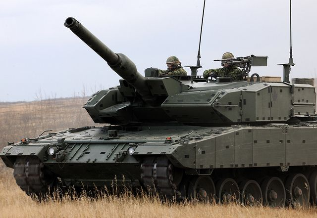|
| 8 | 공중유닛 |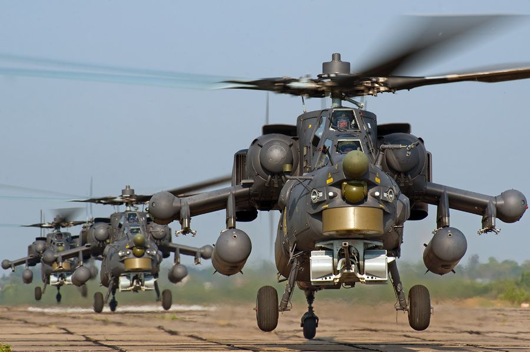 |
| 9 | 전투기,공격기 |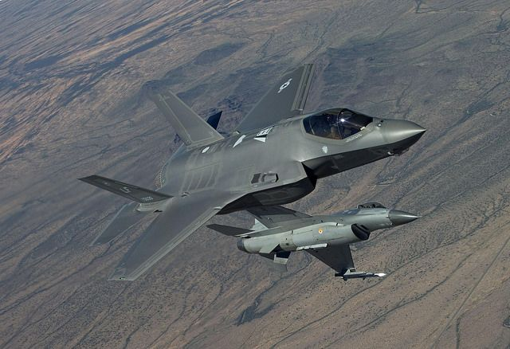 |
| 10 | 폭격기 |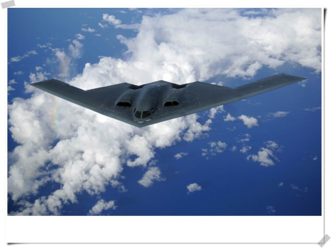 |

*지상유닛:보병,돌격병,저격병,공병,의무병,장갑차,경전차,중전차,자주포  
*해상유닛:초계함,구축함,순양전함,항공모함,잠수함  
*공중유닛:건쉽,수송기,비행선  
*특수유닛:전투기,공격기,폭격기  

## 2. 속성 뽑아 보기
1) 오브젝트 이름 : 도시

| 속성 | 속성값 | 설명 | 비고 |
|:---:|:---:|:---:|:---:|
|체력|1000(임의)|체력을 다다르게 하면 다다르게한 국가의 소속이 된다||
|태그|지상|지상태그가 붙으면 지상만, 해상태그가 붙으면 해상만 다닐수 있음,공중태그가 붙은 유닛은 지상,해상 안 가리고 다닐 수 있음||
|수입_돈|100(임의)|소속된 국가(플레이어)에게 수입주기마다 돈을 준다||
|소속|p1,p2,p3|어느 플레이어에게 소속 되었는지 나타낸다.||

2) 오브젝트 이름 : 자원매장지

| 속성 | 속성값 | 설명 | 비고 |
|:---:|:---:|:---:|:---:|
|체력|2500(임의)|체력을 다다르게 하면 다다르게한 국가의 소속이 된다||
|태그|지상or해상|지상태그가 붙으면 지상만, 해상태그가 붙으면 해상만 다닐수 있음,공중태그가 붙은 유닛은 지상,해상 안 가리고 다닐 수 있음||
|수입_에너지|200(임의)|소속된 국가(플레이어)에게 수입주기마다 에너지를 준다||
|소속|p1,p2,p3|어느 플레이어에게 소속 되었는지 나타낸다.||

3) 오브젝트 이름 : 생산건물_병영

| 속성 | 속성값 | 설명 | 비고 |
|:---:|:---:|:---:|:---:|
|체력||체력이 다다르면 파괴됨||
|태그|지상|지상태그가 붙으면 지상만, 해상태그가 붙으면 해상만 다닐수 있음,공중태그가 붙은 유닛은 지상,해상 안 가리고 다닐 수 있음||
|생산목록|보병,돌격병,저격병,공병,의무병|||
|생산시간||||
|생산비용||||
|생산리스트|배열 값|유닛마다 고유 index가 있으며 특정 index가 생산리스트 배열에 들어가게 된다. index에 부여된 시간이 지나면 유닛을 생성 시킨다.||
|건설시간||건설에 소요되는 시간||
|건물건설비용||건설에 소요되는 비용||
|소속|p1,p2,p3|어느 플레이어에게 소속 되었는지 나타낸다.||

4) 오브젝트 이름 : 생산건물_공장

| 속성 | 속성값 | 설명 | 비고 |
|:---:|:---:|:---:|:---:|
|체력||체력이 다다르면괴됨||
|태그|지상|지상태그가 붙으면 지상만, 해상태그가 붙으면 해상만 다닐수 있음,공중태그가 붙은 유닛은 지상,해상 안 가리고 다닐 수 있음||
|생산목록|장갑차,경전차,중전차,자주포,건쉽,수송기,비행선|||
|생산시간||||
|생산비용||||
|생산리스트|배열 값|유닛마다 고유 index가 있으며 특정 index가 생산리스트 배열에 들어가게 된다. index에 부여된 시간이 지나면 유닛을 생성 시킨다.||
|건설시간||건설에 소요되는 시간||
|건물건설비용||건설에 소요되는 비용||
|소속|p1,p2,p3|어느 플레이어에게 소속 되었는지 나타낸다||

5) 오브젝트 이름 : 방어건물_요새

| 속성 | 속성값 | 설명 | 비고 |
|:---:|:---:|:---:|:---:|
|체력||체력이 다다르면 파괴됨||
|태그|지상|지상태그가 붙으면 지상만, 해상태그가 붙으면 해상만 다닐수 있음,공중태그가 붙은 유닛은 지상,해상 안 가리고 다닐 수 있음||
|공격가능상대|지상or해상or공중|지정된 태그를 달고 있는 적만 타격할 수 있음||
|공격대기상태|true,false|공격대기시간에 돌입할 경우, true를 반환함||
|공격력||피해량||
|공격대기시간||다시 공격하기 까지 걸리는 대기시간. 대기시간이 다 지나면 '공격대기상태'를 false로 만듬||
|사거리||오브젝트 기준, 일정 범위안에 적이 있고 공격가능한 태그를 달고 있으면 공격함||
|건설시간||건설에 소요되는 시간||
|건물건설비용||건설에 소요되는 비용||
|소속|p1,p2,p3|어느 플레이어에게 소속 되었는지 나타낸다.||

6) 오브젝트 이름 : 방어건물_격납고

| 속성 | 속성값 | 설명 | 비고 |
|:---:|:---:|:---:|:---:|
|체력||체력이 다다르면 파괴됨||
|태그|지상|지상태그가 붙으면 지상만, 해상태그가 붙으면 해상만 다닐수 있음,공중태그가 붙은 유닛은 지상,해상 안 가리고 다닐 수 있음||
|생산목록|전투기,공격기,폭격기|||
|생산시간||||
|생산비용||||
|생산리스트|배열 값|유닛마다 고유 index가 있으며 특정 index가 생산리스트 배열에 들어가게 된다. index에 부여된 시간이 지나면 유닛을 생성 시킨다.||
|건설시간||건설에 소요되는 시간||
|건물건설비용||건설에 소요되는 비용||
|비행기출격여부|true,false|비행기를 출격시킬지 말지를 결정. 비행기가 나가 있는 상태라면 비행기를 다시 불러들인다.||
|호위기출격여부|true,false|공격기를 출격시킬 때, 전투기자원을 1소모하여 같이 출격시킬지를 결정||
|전투기최대출격횟수|3(임의)|전투기 편대를 3번 출격시키면 더 이상 전투기를 내보내지 않는다||
|공격기최대출격횟수|3(임의)|공격기 편대를 3번 출격시키면 더 이상 공격기를 내보내지 않는다||
|전투기쿨타임여부|true,false|전투기출격쿨타임이 0이 아니면 true||
|공격기쿨타임여부|true,false|공격기출격쿨타임이 0이 아니면 true||
|전투기출격쿨타임|3s|3대의 전투기를 출격시키고 난뒤, 일정시간후 다른 전투기를 재출격시킴||
|공격기출격쿨타임|3s|3대의 공격기를 출격시키고 난뒤, 일정시간후 다른 공격기를 재출격시킴||
|소속|p1,p2,p3|어느 플레이어에게 소속 되었는가.||

7) 오브젝트 이름 : 지상&해상유닛

| 속성 | 속성값 | 설명 | 비고 |
|:---:|:---:|:---:|:---:|
|체력||체력이 다다르면 파괴됨||
|태그|지상&해상|지상태그가 붙으면 지상만, 해상태그가 붙으면 해상만 다닐수 있음,공중태그가 붙은 유닛은 지상,해상 안 가리고 다닐 수 있음||
|공격가능상대|지상or해상or공중|지정된 태그를 달고 있는 적만 타격할 수 있음||
|공격대기상태|true,false|공격대기시간에 돌입할 경우, true를 반환함||
|공격력||피해량||
|공격대기시간||다시 공격하기 까지 걸리는 대기시간. 대기시간이 다 지나면 '공격대기상태'를 false로 만듬||
|사거리||오브젝트 기준, 일정 범위안에 적이 있고 공격가능한 태그를 달고 있으면 공격함||
|이동속도||유닛의 이동속도||
|공격대상탐색이동|true,false|a키를 누른 뒤, 땅을 좌클릭 하면 유닛이 그곳으로 이동하며 마주치는 적들을 공격함||
|소속|p1,p2,p3|어느 플레이어에게 소속 되었는지 나타낸다.||

8) 오브젝트 이름 : 공중유닛

| 속성 | 속성값 | 설명 | 비고 |
|:---:|:---:|:---:|:---:|
|체력||체력이 다다르면 파괴됨||
|태그|공중|지상태그가 붙으면 지상만, 해상태그가 붙으면 해상만 다닐수 있음,공중태그가 붙은 유닛은 지상,해상 안 가리고 다닐 수 있음||
|공격가능상대|지상or해상|지정된 태그를 달고 있는 적만 타격할 수 있음||
|공격대기상태|true,false|공격대기시간에 돌입할 경우, true를 반환함||
|공격력||피해량||
|공격대기시간||다시 공격하기 까지 걸리는 대기시간. 대기시간이 다 지나면 '공격대기상태'를 false로 만듬||
|사거리||오브젝트 기준, 일정 범위안에 적이 있고 공격가능한 태그를 달고 있으면 공격함||
|이동속도||유닛의 이동속도||
|공격대상탐색이동|true,false|a키를 누른 뒤, 땅을 좌클릭 하면 유닛이 그곳으로 이동하며 마주치는 적들을 공격함||
|소속|p1,p2,p3|어느 플레이어에게 소속 되었는지 나타낸다.||

9) 오브젝트 이름 : 전투기,공격기

| 속성 | 속성값 | 설명 | 비고 |
|:---:|:---:|:---:|:---:|
|체력||체력이 다다르면 파괴됨||
|태그|지상|지상태그가 붙으면 지상만, 해상태그가 붙으면 해상만 다닐수 있음,공중태그가 붙은 유닛은 지상,해상 안 가리고 다닐 수 있음||
|공격가능상대|지상or해상or공중|지정된 태그를 달고 있는 적만 타격할 수 있음|전투기-공중,공격기-지상|
|공격대기상태|true,false|공격대기시간에 돌입할 경우, true를 반환함. true이면, '채공'알고리즘을 작동시킴||
|공격력||피해량||
|공격대기시간||다시 공격하기 까지 걸리는 대기시간. 대기시간이 다 지나면 '공격대기상태'를 false로 만듬||
|사거리||오브젝트 기준, 일정 범위안에 적이 있고 공격가능한 태그를 달고 있으면 공격함||
|이동속도||유닛의 이동속도||
|귀환여부|true,false|비행기가 출격한 격납고에서 비행기출격 여부가 해제 되거나, 비행기 체력이 3/4가 깎이면 격납고로 귀환함.||
|소속|p1,p2,p3|어느 플레이어에게 소속 되었는지 나타낸다.||

10) 오브젝트 이름 : 폭격기

| 속성 | 속성값 | 설명 | 비고 |
|:---:|:---:|:---:|:---:|
|체력||체력이 다다르면 파괴됨||
|태그|지상|지상태그가 붙으면 지상만, 해상태그가 붙으면 해상만 다닐수 있음,공중태그가 붙은 유닛은 지상,해상 안 가리고 다닐 수 있음||
|공격가능상대|지상or해상|지정된 태그를 달고 있는 적만 타격할 수 있음||
|공격력||피해량||
|공격대기시간||다시 공격하기 까지 걸리는 대기시간. 대기시간이 다 지나면 '공격대기상태'를 false로 만듬||
|사거리||플레이어가 클릭한 위치가 사거리 안에 들어오면 공격함||
|이동속도||유닛의 이동속도||
|귀환여부|true,false|공격을 완료하거나, 비행기 체력이 3/4가 깎이면 격납고로 귀환함.||
|소속|p1,p2,p3|어느 플레이어에게 소속 되었는지 나타낸다.||

## 3. 행동 뽑아 보기

1) 오브젝트 이름: 도시

| 행동 | 설명 |
|:---:|:---:|
|돈수입|소유자에게 수입주기마다 돈을 줌|
|소유권변경|체력이 0이 되면 체력을 다다르게한 플레이어의 소유가 됨|

2) 오브젝트 이름: 자원매장지

| 행동 | 설명 |
|:---:|:---:|
|에너지수입|소유자에게 수입주기마다 에너지를 줌|
|소유권변경|체력이 0이 되면 체력을 다다르게한 플레이어의 소유가 됨|

3) 오브젝트 이름: 생산건물_병영

| 행동 | 설명 |
|:---:|:---:|
|건설중|건물이 제 기능을 할 수 있을 때 가지 걸리는 시간|
|건설됨|건물이 제 기능을 할 수 있는 상태(기본상태)|
|유닛생산중|생산리스트에 생산할 유닛리스트를 추가함. 시간이 다되면 유닛생성|
|파괴|체력이 0이 되면 오브젝트 삭제|

4) 오브젝트 이름: 생산건물_공장

| 행동 | 설명 |
|:---:|:---:|
|건설중|건물이 제 기능을 할 수 있을 때 가지 걸리는 시간|
|건설됨|건물이 제 기능을 할 수 있는 상태(기본상태)|
|유닛생산중|생산리스트에 생산할 유닛리스트를 추가함. 시간이 다되면 유닛생성|
|파괴|체력이 0이 되면 오브젝트 삭제|

5) 오브젝트 이름: 방어건물_요새

| 행동 | 설명 |
|:---:|:---:|
|건설중|건물이 제 기능을 할 수 있을 때 가지 걸리는 시간|
|건설됨|건물이 제 기능을 할 수 있는 상태(기본상태)|
|공격상태|오브젝트 기준 일정 범위안에 적이 있고, 공격가능한 태그를 달고있으면 공격함|
|파괴|체력이 0이 되면 오브젝트 삭제|

6) 오브젝트 이름: 방어건물_격납고

| 행동 | 설명 |
|:---:|:---:|
|건설중|건물이 제 기능을 할 수 있을 때 가지 걸리는 시간|
|건설됨|건물이 제 기능을 할 수 있는 상태(기본상태)|
|유닛생산중|생산리스트에 생산할 유닛리스트를 추가함. 시간이 다되면 유닛생성|
|출격여부체크|비행기의 출격 시킬 것인지 여부를 검사함. false일 경우, ‘탐색’ 작업을 진행하지 않음|
|탐색|사거리 안에 적이 존재하는지 확인 함. 그리고 그 적의 태그를 확인함|
|생성|적의 태그에 따라 전투기or공격기를 생성함. 생성시 전투기or공격기 자원소모|
|횟수검사|전투기나 공격기를 얼마나 내보냈는지 체크함.|
|쿨타임검사|재출격까지 남은 시간을 검사함. true이면 ‘검사’단계로 넘어감|
|파괴|체력이 0이 되면 오브젝트 삭제|

7) 오브젝트 이름: 지상&해상유닛

| 행동 | 설명 |
|:---:|:---:|
|이동상태|플레이어가 클릭한 곳으로 향함. 단, 갈수 있는 영역이 병력 분류마다 다름|
|공격상태|오브젝트 기준 일정 범위안에 적이 있고, 공격가능한 태그를 달고있으면 공격함|
|공격대상탐색이동|a키를 누른 뒤, 땅을 좌클릭 하면 유닛이 그곳으로 이동하며 마주치는 적들을 공격함|
|파괴|체력이 0이 되면 오브젝트 삭제|

8) 오브젝트 이름: 공중유닛

| 행동 | 설명 |
|:---:|:---:|
|이동상태|플레이어가 클릭한 곳으로 향함. 단, 갈수 있는 영역이 병력 분류마다 다름|
|공격상태|오브젝트 기준 일정 범위안에 적이 있고, 공격가능한 태그를 달고있으면 공격함|
|공격대상탐색이동|a키를 누른 뒤, 땅을 좌클릭 하면 유닛이 그곳으로 이동하며 마주치는 적들을 공격함|
|파괴|체력이 0이 되면 오브젝트 삭제|

9) 오브젝트 이름: 전투기,공격기

| 행동 | 설명 |
|:---:|:---:|
|이동상태|격납고 탐색영역 내의 타격가능한 적을 향해 이동함.|
|공격|오브젝트 기준 일정 범위 안에 적이 있고, 공격 가능한 태그를 달고 있으면 공격함|
|채공|공격대기상태가 true일 때 자동발동. 타겟의 위치를 기준으로 일정 범위 안을 무작위로 마구 돌아다님. 공격대기상태가 다시 false가 되면 ‘이동상태’로 이동함|
|귀환|체력이 1/4이하가 되면 귀환함. 혹은 출발한 격납고의 출격여부가 false로 되어 있으면 귀환.|
|파괴|체력이 0이 되면 오브젝트 삭제|

10) 오브젝트 이름: 폭격기

| 행동 | 설명 |
|:---:|:---:|
|이동상태|플레이어가 클릭한 곳으로 향함|
|공격상태|플레이어가 클릭한 곳이 사거리 안에 들어 왔을 때, 플레이어가 클릭한 곳에 폭탄을 떨굼|
|귀환|체력이 1/4이하가 되면 귀환함. 혹은 공격을 완료하면 귀환함.|
|파괴|체력이 0이 되면 오브젝트 삭제|

## 4. 상태 뽑아 보기

1) 오브젝트 이름: 도시

| 행동 | 설명 | 전이조건 |
|:---:|:---:|:---:|
|A플레이어 소속|B플레이어 소속|B플레이어가 도시에 마지막 일격을 가했을 때|

2) 오브젝트 이름: 자원매장지

| 행동 | 설명 | 전이조건 |
|:---:|:---:|:---:|
|A플레이어 소속|B플레이어 소속|B플레이어가 자원매장지에 마지막 일격을 가했을 때|

3) 오브젝트 이름: 생산건물_병영

| 행동 | 설명 | 전이조건 |
|:---:|:---:|:---:|
|-|건설중|플레이어가 건설 명령을 내렸을 때|
|건설중|대기상태(기본상태)|'건설중'상태에서 일정 시간이 지났을 때|
|대기상태|유닛생산중|플레이어가 유닛을 생산하는데 요구하는 자원을 지불했을 때|
|유닛생산중|대기상태|생산리스트에 아무것도 있지 않을 때|
|건설중or대기상태or유닛생산중|파괴(삭제)|오브젝트의 체력수치가 0이하가 됬을 때.|

4) 오브젝트 이름: 생산건물_공장

| 행동 | 설명 | 전이조건 |
|:---:|:---:|:---:|
|-|건설중|플레이어가 건설 명령을 내렸을 때|
|건설중|대기상태(기본상태)|'건설중'상태에서 일정 시간이 지났을 때|
|대기상태|유닛생산중|플레이어가 유닛을 생산하는데 요구하는 자원을 지불했을 때|
|유닛생산중|대기상태|생산리스트에 아무것도 있지 않을 때|
|건설중or대기상태or유닛생산중|파괴(삭제)|오브젝트의 체력수치가 0이하가 됬을 때.|

5) 오브젝트 이름: 방어건물_요새

| 행동 | 설명 | 전이조건 |
|:---:|:---:|:---:|
|-|건설중|플레이어가 건설 명령을 내렸을 때|
|건설중|대기상태(기본상태)|'건설중'상태에서 일정 시간이 지났을 때|
|대기상태|공격상태|오브젝트 기준, 일정 범위 안에 적이 있고, 공격가능한 태그를 달고 있을 때|
|공격상태|대기상태|오브젝트 기준, 일정 범위 안에 적이 없거나, 적이 공격가능한 태그를 달고 있지 않을 때|
|건설중or대기상태or유닛생산중|파괴(삭제)|오브젝트의 체력수치가 0이하가 됬을 때.|

6) 오브젝트 이름: 방어건물_격납고

| 행동 | 설명 | 전이조건 |
|:---:|:---:|:---:|
|-|건설중|플레이어가 건설 명령을 내렸을 때|
|건설중|대기상태(기본상태)|'건설중'상태에서 일정 시간이 지났을 때|
|대기상태|유닛생산중|플레이어가 유닛을 생산하는데 요구하는 자원을 지불했을 때|
|유닛생산중|대기상태|생산리스트에 아무것도 있지 않을 때|
|탐색(영구지속)||건설된 상태이기만 한다면 && 비행기출격여부가true일 때|
|탐색|전투기생성|사거리 안에 공중 태그를 지닌 적이 존재함 && 3대 이상의 전투기자원을 보유중일 때 && 전투기출격횟수가 < 3 일 때 && 전투기쿨타임여부가 false일 때|
|탐색|공격기생성(호위기x)|(사거리 안에 지상or해상 태그를 지닌 적이 존재함 && 2대 이상의 공격기자원을 보유중일 때 && 공격기출격횟수가 < 3 일 때 && 공격기쿨타임여부가 false일 때)혹은,(호위기여부가true이나, 전투기자원이 0이고, 2대 이상의 공격기자원을 가졌고, 공격기출격횟수가 < 3 일 때 && 공격기쿨타임여부가 false일 때)) |
|탐색|공격기생성(호위기o)|사거리 안에 지상or해상 태그를 지닌 적이 존재함 && 2대 이상의 공격기자원을 보유중일 때 && 1대 이상의 전투기 자원을 보유 중일 때 &&7공격기출격횟수가 < 3 일 때 && 호위기여부가 true일 때　&& 공격기쿨타임여부가 false일 때|
|쿨타임은 파라미터 속성 뽑아 보기에 정리되어 있음|||
|건설중or대기상태or유닛생산중|파괴(삭제)|오브젝트의 체력수치가 0이하가 됬을 때.|

7) 오브젝트 이름: 지상&해상유닛

| 행동 | 설명 | 전이조건 |
|:---:|:---:|:---:|
|대기상태|이동상태|플레이어가 유닛을 지정한 상태에서 땅을 우클릭 했을 때 && 유닛의 태그가 지형의 태그와 같을 경우.|
|공격상태|이동상태|플레이어가 유닛을 지정한 상태에서 땅을 우클릭 했을 때 && 유닛의 태그가 지형의 태그와 같을 경우.|
|대기상태|공격상태|오브젝트 기준 일정 범위 안에 적이 있고, 공격 가능한 태그를 달고 있으면 공격함|
|이동상태|공격상태|오브젝트 기준 일정 범위 안에 적이 있고, 공격 가능한 태그를 달고 있음 && ‘공격대상탐색이동’ 이 true 일 때|
|공격상태|대기상태|오브젝트 기준 일정 범위 안에 타격 가능한 적이 없을 때.|
|대기상태or이동상태or공격상태|파괴(삭제)|오브젝트의 체력수치가 0이하가 됬을 때.|

8) 오브젝트 이름: 공중유닛

| 행동 | 설명 | 전이조건 |
|:---:|:---:|:---:|
|대기상태|이동상태|플레이어가 유닛을 지정한 상태에서 땅을 우클릭 했을 때 && 유닛의 태그가 지형의 태그와 같을 경우.|
|공격상태|이동상태|플레이어가 유닛을 지정한 상태에서 땅을 우클릭 했을 때 && 유닛의 태그가 지형의 태그와 같을 경우.|
|대기상태|공격상태|오브젝트 기준 일정 범위 안에 적이 있고, 공격 가능한 태그를 달고 있으면 공격함|
|이동상태|공격상태|오브젝트 기준 일정 범위 안에 적이 있고, 공격 가능한 태그를 달고 있음 && ‘공격대상탐색이동’ 이 true 일 때|
|공격상태|대기상태|오브젝트 기준 일정 범위 안에 타격 가능한 적이 없을 때.|
|대기상태or이동상태or공격상태|파괴(삭제)|오브젝트의 체력수치가 0이하가 됬을 때.|

9) 오브젝트 이름: 전투기

| 행동 | 설명 | 전이조건 |
|:---:|:---:|:---:|
|대기상태|이동상태|생성될 때 && 적이 격납고 사거리 안에 있을 때(생성될 때 전투기 자원 –1)|
|이동상태|공격상태|오브젝트 기준 일정 범위 안에 적이 있고, 공격 가능한 태그를 달고 있음|
|공격상태|채공상태|공격대기상태가 true임 && 타겟으로 정한 적이 존재함|
|채공상태|이동상태|공격대기상태가 false임 or 타겟으로 정한 적이 사라졌을 때(격납고 사거리를 벗어나거나, 파괴됬을 시)|
|이동상태or채공상태|귀환상태|격납고 사거리 안에 어떠한 적도 없을 때 or 체력이 1/4 이하일 때|
|귀환상태|파괴(삭제)|귀환여부가 true이고, 오브젝트의 위치값이 격납고와 같을 때. (전투기 자원 +1)|
|이동상태or공격상태or채공상태or귀환상태|파괴(삭제)|오브젝트의 체력수치가 0이하가 됬을 때.(전투기 자원 +1을 하지 않는다)|
|대기상태|호위상태|생성될 때 && 격납기의 ‘호위기여부상태’가 true 일 때 && 공격기 생성을 통해 나온 전투기 일 때‘호위기능’ 알고리즘을 실행함|

*호위기능: 공격기를 따라다니다 공중태그가 붙은 적과 마주치면 공격함

10) 오브젝트 이름: 공격기

| 행동 | 설명 | 전이조건 |
|:---:|:---:|:---:|
|대기상태|이동상태|생성될 때 && 적이 격납고 사거리 안에 있을 때(생성될 때 공격기 자원 –1)|
|이동상태|공격상태|오브젝트 기준 일정 범위 안에 적이 있고, 공격 가능한 태그를 달고 있음|
|공격상태|채공상태|공격대기상태가 true임 && 타겟으로 정한 적이 존재함|
|채공상태|이동상태|공격대기상태가 false임 or 타겟으로 정한 적이 사라졌을 때(격납고 사거리를 벗어나거나, 파괴됬을 시)|
|이동상태or채공상태|귀환상태|격납고 사거리 안에 어떠한 적도 없을 때 or 체력이 1/4 이하일 때|
|귀환상태|파괴(삭제)|귀환여부가 true이고, 오브젝트의 위치값이 격납고와 같을 때. (공격기 자원 +1)|
|이동상태or공격상태or채공상태or귀환상태|파괴(삭제)|오브젝트의 체력수치가 0이하가 됬을 때.(공격기 자원 +1을 하지 않는다)

11) 오브젝트 이름: 폭격기

| 행동 | 설명 | 전이조건 |
|:---:|:---:|:---:|
|대기상태|이동상태|생성될 때&&플레이어가 클릭했을 때.(생성될 때 폭격기 자원 -1)|
|이동상태|공격상태|플레이어가 클릭한 곳이 사거리 안에 들어 왔을 때|
|이동상태or공격상태|귀환상태|체력이 1/4이하가 되거나 공격을 완료하면 귀환함(폭격기 자원 +1)|
|이동상태or공격상태or귀환상태|파괴(삭제)|오브젝트의 체력수치가 0이하가 됬을 때.(폭격기 자원 +1을 하지 않는다)|

## 5. 플레이어 캐릭터 속성

1) 전 오브젝트 공통속성

| 속성 | 영문명칭 | 설명 | 비고 |
|:---:|:---:|:---:|:---:|
|체력|health|0이 되면 오브젝트 삭제|도시&자원매장지의 경우엔 소속이 넘어감|
|태그|tag|지상,해상,공중의 3가지 태그가 존재한다||
|소속|belong|오브젝트의 소유권. 소유권을 가진 플레이어만이 오브젝트에 명령을 내릴수 있다||

2) 건물&유닛 공통속성

| 속성 | 영문명칭 | 설명 | 비고 |
|:---:|:---:|:---:|:---:|
|방어력|armor|공격데미지를 경감시켜준다||

3) 건물 공통속성

| 속성 | 영문명칭 | 설명 | 비고 |
|:---:|:---:|:---:|:---:|
|건설시간|build_time|건설명령을 내리면 그 자리에 건설중인 건물이 나타난다|건설진행도에 비례해 체력이 올라가는 방식|
|건물건설비용|build_cost|건설에 필요한 자원||

4) 생산건물 공통속성

| 속성 | 영문명칭 | 설명 | 비고 |
|:---:|:---:|:---:|:---:|
|생산목록|production_list|유닛생산목록|건물마다다름|
|생산시간|production_time|유닛 생산에 필요한 시간||
|생산비용|production_cost|유닛생산에 필요한 비용||
|생산리스트|production_queue|유닛 생산 대기열|최대5개|

5) 공격가능오브젝트 공통속성

| 속성 | 영문명칭 | 설명 | 비고 |
|:---:|:---:|:---:|:---:|
|공격력|power|적 유닛에 피해를 주는 양||
|공격대기상태|is_cooltime|다시 공격을 하기 위한 준비상태인지 체크||
|공격대기시간|cooltime|다시 공격을 하기 위한 준비시간||
|공격가능상대|attack_possible|사거리 안에 있을시, 공격 가능한 상대인지 태그를 두고 비교함||
|사거리|range|말 그대로 사거리||

6) 유닛공통속성

| 속성 | 영문명칭 | 설명 | 비고 |
|:---:|:---:|:---:|:---:|
|이동속도|speed|말 그대로 이동속도||

## 6. 게임의 규칙

-핵심 규칙  
* 승리 
	* 게임시작, 20분이 지난 후, 승자를 가른다. 승자를 가르는 기준은, 모든 유저 gdp의 50% 이상을 차지한 상태를 일정시간 유지하면 승리.  
-보조 규칙  
* 동맹
	* 동맹을 맺을 수는 있으나, 파기할 때는 병력을 상대방의 본진에 배치시킨 뒤 기습공격 하는 플레이를 막기 위해 별도의 규칙이 적용된다. 동맹을 파기하는 순간, 상대방의 도시나 자원매장지에서 일정 거리 안에 있는 유닛들은 제일 가까운 자신의 도시 근처에 강제배치 된다. (해상유닛의 경우 제일 가까운 도시가 내륙일 때, 해안도시로 배치 되게 된다.)

## 7. 게임에 사용될 공식
* 데미지 계산 공식  
	* 체력 - (상대방공격력 - 내방어력)

* 사정거리 내 적 유닛 존재여부 검사 방법  
	* 전쟁중인 적 플레이어 중에서 시야안에 들어온 적 유닛들을 ‘vector3.Distance(pos1, pos2)’를 이용해서 거리 안에 들어 왔는지 탐지(단 이건 유닛 하나하나가 적 유닛 하나하나와 다 검사를 해야 하기 때문에 연산에 엄청난 부담이 있을 것임.. 방법을 강구해야함)

*  유닛 여러개 이동  
	* 유닛마다 고유의 충돌범위가 있고, 유닛을 여러개 지정 후 이동하면, 충돌범위만큼 서로 거리를 둔 채 이동한다.
(유닛이 겹치는거 예방, 충돌범위 지정해서 사용하면 됨)

* 유닛 지정 후 이동명령 내리기  
	* ‘a 알고리즘’을 이용해 지형지물이 존재하면, 돌아가게 만드는 기능(유니티에서 지원함)

* 채공 알고리즘 발동조건과 그 설명
	* 격납고 탐색영역내의 타격가능한 적을 향해 이동함.  
	* 전투기 기준 일정 범위 안에 적이 있고, 공격 가능한 태그를 달고 있으면 공격  
	* 공격대기상태일때, 채공 알고리즘 작동  
		ㄴ 채공 알고리즘: 공격한 적의 위치를 기준으로 일정 범위 안을 무작위로 마구 돌아다님  
	* 공격대기상태에서 벗어나면, 1번부터 다시 시작

# 개발 요구사항 & 흐름도
## a. 요구사항
* 화면에는 메인화면, 방 찾기 화면, 방 설정 화면, 방 화면, 게임화면, 설정화면이 존재한다
	* '메인화면'에는 방 찾기, 방 만들기, 설정, 게임종료 버튼이 존재한다
	* '방 찾기 화면'에는 방 목록, 방정보, 돌아가기 버튼이 존재한다
	* '방 설정 화면'에는 방 제목, 비밀번호, 공개/비공개, 돌아가기 버튼이 있으며, 유저가 건드릴 수 없는 '방번호'도 존재한다. 방번호는 방들을 구분하기 위한 고유의 값이다.
	* '방 화면'에는 유저목록, 채팅창, 시작, 나가기 버튼이 있다.
	* '게임화면'에는 자원정보창, 세세한정보창, 채팅창, 메뉴창, 미니맵, 오브젝트정보창, 타이머창이 있다.
		* 세세한정보창: '플레이어목록', '설계도', '건설목록'항목이 있다
			* 플레이어목록: 점수를 기준으로 오름차순 으로 배열 되며, 유저에다 우클릭을 해서 외교를 진행할 수 있다.
			* 설계도: 현재 차지한 수도목록에 근거해 사용할 수 있는 특수유닛이 존재하며, 만약 특수유닛의 병종이 겹친다면 어느 유닛을 사용할 것인지를 정할 수 있다.
			* 건설목록: 건설가능한 건물들이 나열되며, 건물을 누르고 맵상에 설치하면, 건물이 나타난다.
		* 자원정보창: 돈, 에너지, 보유비행기댓수(전투기,공격기,폭격기) 정보를 나타낸다.
		* 타이머: 게임시작 20분 후에 작동되며, 모든 유저점수의 과반을 차지한 유저가 나오면 작동됨. 타이머가 다되면 점수 과반을 차지한 유저의 승리.
		* 오브젝트정보창: 선택한 오브젝트의 정보를 표기하는 창.

* 건설관리:  
	* 건설방법: B키를 누르면 건설 가능 리스트 들이 표시된다. 거기서 건설하고 싶은 건물을 클릭해(아니면 단축키) 땅에다 좌클릭하면 건설 된다.(좌클릭시 커서를 중심으로 건물이 배치 되며, 건물의 크기만큼 건설범위가 정해진다. 건설범위 안에 건설할 수 없는 영역이 있으면 건설 불가 표시를 띄우며, 이때는 어떤 좌클릭을 해도 건설이 되지 않는다)
	
* 오브젝트관리: '게임화면'에서 사용되는 오브젝트 관련 요구사항
	* 오브젝트지정
		* 좌클릭: 좌클릭하면 클릭한 오브젝트의 정보가 표시된다.
		* 더블클릭&ctrl + 좌클릭: 화면안에 있는 해당 오브젝트와 같은 유닛들이 지정된다.
		* 드래그: 드래그 영역 내의 유닛들이 지정된다
		* 우클릭: 지정된 유닛들을 클릭한 곳으로 이동시킨다. (단, 유닛과 지형의 태그를 비교해 이동할지 안 할지를 결정한다.)
	* 부대지정
		* 오브젝트들이 지정된 상태에서 ctrl + 숫자키를 누르면 큐 형태로 저장된다.
		* 그 다음 숫자키를 누르면 저장된 오브젝트들이 지정된다.

## b. 요구사항(6주짜리)
기본적인 조작에 필요한 기능들 위주로 구현할 예정.

* 카메라조정
	* 카메라 조작
		* 커서를 화면 가장자리에 갔다대면 카메라의 위치가 마우스 가 위치한 방향으로 이동한다.
		* 미니맵의 어떤 지점을 클릭하면 그 지점에 해당하는 곳으로 카메라의 위치가 정해진다. 
* 맵 구현
	* 격자타일의 맵을 생성하기.(각 타일은, 지형정보를 갖고있음(지상,해상 두 개)
	
* 미니맵구현(1번의 연장선)
	* 게임 맵의 형태를 축소한 형태의 맵을 게임 화면 우측하단에 위치시킨다.
	* 미니맵의 어떤 지점을 클릭하면 그 지점에 해당하는 곳으로 카메라의 위치가 정해진다.
	
* 유닛 이동
	* 클릭한 곳으로 오브젝트를 이동시키기 (단, 이동할 수 있는 지형에만 이동 하게 하기.(ex_지상유닛은 타일의 정보를 받아서 지상일때만 이동 가능하게 하기)
	
## c. 키보드에 대한 흐름도
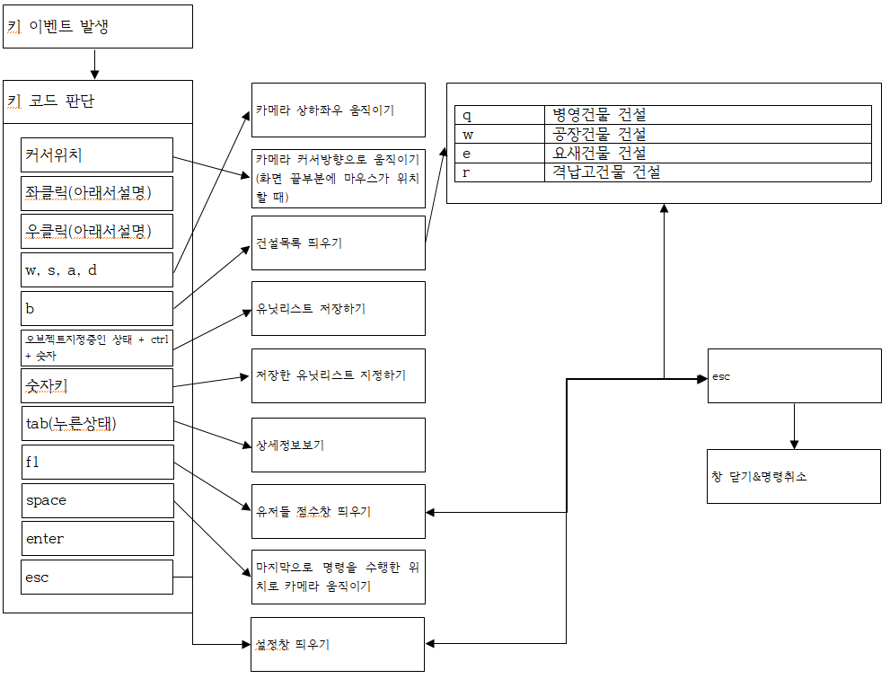
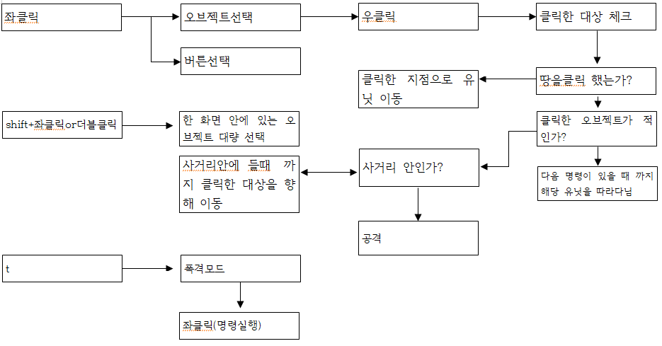

## b. 용어정리
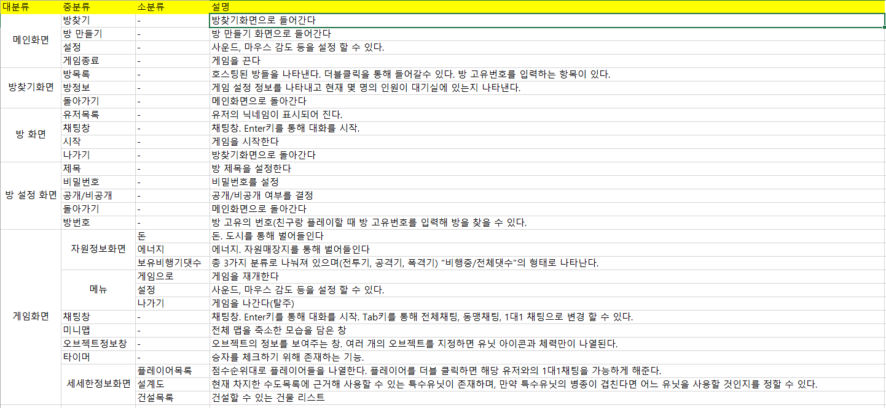

# 스토리보드
대략 여러개의 플레이 할 수 있는 나라들이 나열되어 있고 각 나라마다 짤막한 스토리를 추가할 예정이다.
현실의 국가들을 모티브로 제작할 예정. 몇몇은 현실의 국가를 그대로 가져올 예정  
ex)

| 국가 | 현실의국가 |
|:---:|:---:|
|고려연방|대한민국+북한|
|일본|일본|
|중화인민공화국|중국|
|다이칭 구륜|중국|
|동튀르크스탄|중국|
|티벳트|중국|
|중화민국|대만|

# 개발작업 일정
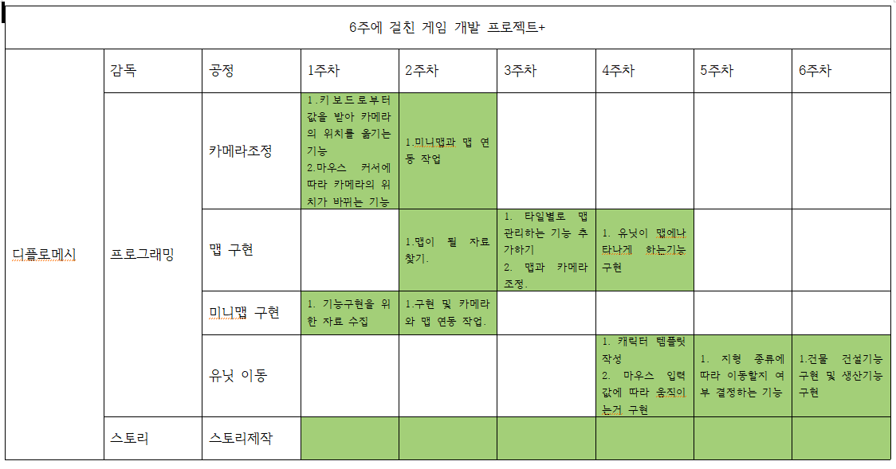
	
## 1주차
카메라를 움직이게 하는 기능 및 카메라 줌인 기능  

## 2주차
지도를 본뜬 모습이 작은 화면에 나타나게하는 미니맵 기능  
카메라가 보고 있는 영역이 미니맵에 나타나게 하는 기능

## 3주차
클릭을 통해 유닛을 지정하는 기능  
드래그를 통해 유닛들을 지정하는 기능 및 드래그 영역을 표시하는 기능  

## 4주차
선택된 유닛들을 우클릭한 영역으로 이동시키는 기능 및 자동 길찾기 기능  
선택된 유닛들이 클릭된 지점을 기준으로 포지션을 갖추게 하는 기능

## 5주차
유닛의 정보를 담은 데이터베이스 제작  
일정 범위안에 적을 탐지하는 기능

## 6주차
탐지된 적을 향해 달려가게하는 기능  
유닛마다 부여된 사거리 영역 안에 적이 들어오면 멈추는 기능 및 적을 바라보는 기능

## 7주차
적을 공격하는 기능 및 체력, 방어력에 따라 피해량을 계산해 적용시키는 기능 및 체력이 다되면 파괴되는 기능  
공격쿨타임 기능  
탱크 제작_ 몸체와 포탑 부분을 따로분리시켜 서로 다른 메카니즘으로 작용하게끔 하는 기능  
ㄴ 포탑이 자연스럽게 적을향해 돌아가게 하는 기능
도시 제작_ 도시의 체력이 0이되면 체력을 0으로 만든 세력의 것이 되게하는 기능

## 8주차
숫자키 (1~7번)을 통해 유닛들을 생성하는 기능 및 배경음악 재생기능  
